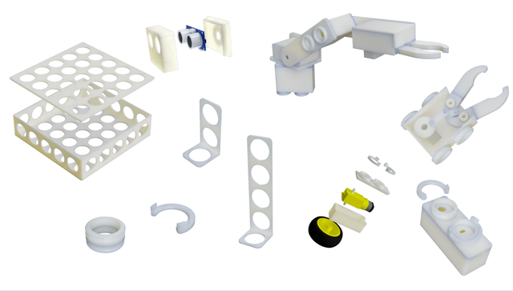

# The designs of the DIY-Robot kit

Here you can find all the stl files for the kit. For instructions and images visit the wiki of the repository . 

* Socket System templates 
  * Connection System between components blocks :white_check_mark:
  * Lock System between for components blocks :white_check_mark:
  * Raspberry Pi 3 self lock base :white_check_mark:
  * L298N Dual H-Bridge self lock base :white_check_mark:
* Motor Block 
  * Top part :white_check_mark:
  * Bottom part :white_check_mark:
* Free rotation modules
  * Metal Ball Caster :white_check_mark:
  * Free rotation wheel module :white_check_mark:
* Main body 
  * Top part :white_check_mark:
  * Bottom part :white_check_mark:
* Boards modules
  * Raspberry Pi 3 self lock base with male socket :white_check_mark:
  * L298N Dual H-Bridge self lock base with male socket :white_check_mark:
  * Arduino Mega self lock base with male socket :construction:
  * Arduino Uno self lock base with male socket :construction:
* Wire grouping socket 
  * 4 Wire socket  :construction:
  * 3 Wire socket :warning:
  * 2 Wire socket  :construction:
  * 8 Pin expansion suitable for GND and VCC  :white_check_mark:
* Servo Blocks
  * SG-5010 Servo :white_check_mark:
  * NG-90 Microservo :construction:
* Arm parts
  * Rotation base :white_check_mark:
  * Arm extension servo head socket :white_check_mark:
  * Robotic Arm Gripper :white_check_mark:
* Sensors Blocks
  * Raspberry Pi Camera Block :white_check_mark:
  * Ultrasonic sensor HC-SR04 :white_check_mark:
  * IR Infrared Obstacle :white_check_mark:
  * Sensor extender 2 socket L shape:white_check_mark:
  * Dual male connector for Sensor extenders :white_check_mark:
  * Breadboard module :white_check_mark:
  * Magic Super-Mini-Breadboard :white_check_mark:
  * Nokia 5110 LCD screen module :white_check_mark:
  * Optical odometer HC-020K module :white_check_mark:

## Explanation of the marks
* :warning: Under Construction part, not ready for printing yet.
* :white_check_mark: Ready for printing.
* :construction: Upcoming release
