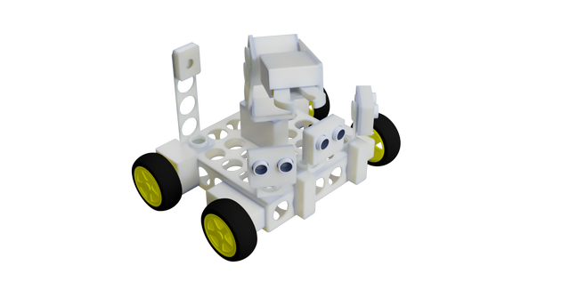

:rocket: GSOC 2021 - A DIY robot kit for educators
===============

## In a nutshell
 
The goal of the project is to develop a low-cost DIY robot kit, including the designs, 
tutorials and use-case scenarios. The DIY robot kit should be 3d-printed, assembled 
and operated using basic electronics and sensors. This project was developed during 
GSoC 2021 in collaboration with Open Technologies Alliance (GFOSS).

## Introduction

The aim of the project will be to develop all the designs, guidelines and sample code for a
starter DIY robot kit that can be 3d-printed, assembled and operated using basic electronics and
sensors. This is expected to create a low-cost alternative to commercial robot kits (e.g. Lego
Mindstorms) that does not require expert staff in robotics, electronics or IoT programming (e.g.
using Arduino/Raspberry kits). The ability to 3D-print everything and combine it with low-cost
basic electronics and sensors will allow regional open technologies initiatives to provide schools
with starter kits and a full 'Robotic 101' introductory course.

The target audience of the project can be educators, e.g. high school teachers. Thus, the project
contins for interesting yet simple use-case scenarios and guidelines for the assembly and
programming that are straightforward, even for educators with minimum expertise in
robotics, electronics, and programming. The documentation has a modular structure
that allows educators to guide their students to the step-by-step development of the robot and to
the implementation of simple navigation or sensing scenarios that require basic programming
skills.

This project is actually a continuation of a [previous GSoC project](https://github.com/eellak/gsoc2019-diyrobot/tree/master) 
that was developed by [Christos Chronis](https://github.com/chronis10) in collaboration with GFOSS.

## GSoC Information

You can view the project on Google Summer of Code website [here]](https://summerofcode.withgoogle.com/dashboard/project/4753897953951744/overview/).

You can also see the detailed timeline [here](./gsoc-timeline.md).

<!-- ### Proteas robot teaser video

 -->

<!-- 
Final Report
------------

You can visit this [gist](https://gist.github.com/chronis10/9d069c56b3df9c92693ac8d24270a62a) that summarizes in a few words, the work which was done during the Google Summer of Code working period. -->

<!-- Synopsis
--------

With this project you can construct a modular robot, easy to use with cheap electronic parts and 3D printed parts. The procedure to construct the robot is explained detailed on the [Wiki](https://github.com/eellak/gsoc2019-diyrobot/wiki) of the project. The main procedure is:

1. Read the wiki and choose the type of robot you want
2. Gather all the needed electronic parts
3. Print the parts
4. Preassembly the blocks
5. Burn the custom Raspbian image and load it to the Raspberry PI
6. Assembly the robot
7. Power on the robot 
8. Connect to proteas network and have fun. -->

<!-- Challenges -> Problems -> Solutions
--------

The main challenge of the project was the requirement to avoided the usage of tools on the assembly stage. The first days of the project I designed and tested about ten different designs of the socket system. Another problem was the voltages of the electronic parts, most of the parts are designed to work with the Arduino 5V voltages but the Raspberry Pi voltages are 3V and for that reason used a Bidirectional Logic Level Converter.  Also the investigation of a stable and capable power source  was crucial because nobody wants a robot with short working time, finally selected a custom build power block (BMS, Li-ion batteries and stepdown circuit) which offers excellent performance, recharging capability, usage of the robot with external power supply and long working time. Finally because the robot needed to be easy to programme form people with low experience with programming, decided to use a object oriented way. The code for the electronic parts in some cases it was complicated for a new user and using the object oriented way the code transformed from 50 lines to 3 lines easy to understand and use code. 

 -->

<!-- GSoC Deliverables
------------

1. 3D printed parts ready to print
2. Python library for easy usage and control of the robot
3. Integration with Jupyter
4. Easy way to access the robot
5. Custom Raspbian image with OpenCV, Jupyter, Node.js, Python libraries, instructions and configuration intergraded.
6. Extensive instruction for the assembly and usage
7. Jupyter Notebooks with examples and educational material -->

<!-- Future Work
------------

There is still a lot work that may be done, in order the Proteas robot to be a direct competitive to any commercial alternative on education robotics and I believe, with the support of the Open Source community, that goal can be reached. Feel free, to contribute and participate on that project, any suggestion and improvement are welcomed. 

Some thoughts for future work:

1. Support of analogue sensors
2. More 3D printed components
3. More electronic sensors support
4. Improvements on designs
5. Integration with Scratch, Node-RED
6. Compatibility with Arduino
7. Better wireless connection 
8. Companion app for Android/IOS
9. Custom build PCB for easy connection of the electronic components -->

### Student

* [Yiorgos Yiannakoulias (Georgios Giannakoulias)](https://github.com/yiorgosynkl)

### GSoC Mentors

* Iraklis Varlamis
* Theodoros Karounos
* Konstantinos Kalovrektis

### Organization :  Open Technologies Alliance - GFOSS 

 The 3D designs , educational material and text is licensed under a  <a rel="license" href="http://creativecommons.org/licenses/by-nc/4.0/">Creative Commons Attribution-ShareAlike 4.0 International License</a>

:rocket: GSOC 2019 - A DIY robot kit for educators 
===============

## Introduction
With this project I designed an easy to assembly and program, robot from scratch. The designs are 3D printable and all the electronics parts are easy to find in any electronic equipment store. The robot has the  Raspberry Pi 3+  as the main computer with Raspbian operating system combined with Jupyter Notebook as programing interface and a Node.js application as front-end main control page. You can program and control the robot through your browser using the Proteas wireless access point. 

[View the project on Google Summer of Code website](https://summerofcode.withgoogle.com/projects/#6536613096587264).

You can see the detailed timeline [here](https://github.com/eellak/gsoc2019-diyrobot/blob/master/gsoc-timeline.md).

### Proteas robot teaser video

Final Report
------------

You can visit this [gist](https://gist.github.com/chronis10/9d069c56b3df9c92693ac8d24270a62a) that summarizes in a few words, the work which was done during the Google Summer of Code working period.

Synopsis
--------

With this project you can construct a modular robot, easy to use with cheap electronic parts and 3D printed parts. The procedure to construct the robot is explained detailed on the [Wiki](https://github.com/eellak/gsoc2019-diyrobot/wiki) of the project. The main procedure is:

1. Read the wiki and choose the type of robot you want
2. Gather all the needed electronic parts
3. Print the parts
4. Preassembly the blocks
5. Burn the custom Raspbian image and load it to the Raspberry PI
6. Assembly the robot
7. Power on the robot 
8. Connect to proteas network and have fun.

Challenges -> Problems -> Solutions
--------

The main challenge of the project was the requirement to avoided the usage of tools on the assembly stage. The first days of the project I designed and tested about ten different designs of the socket system. Another problem was the voltages of the electronic parts, most of the parts are designed to work with the Arduino 5V voltages but the Raspberry Pi voltages are 3V and for that reason used a Bidirectional Logic Level Converter.  Also the investigation of a stable and capable power source  was crucial because nobody wants a robot with short working time, finally selected a custom build power block (BMS, Li-ion batteries and stepdown circuit) which offers excellent performance, recharging capability, usage of the robot with external power supply and long working time. Finally because the robot needed to be easy to programme form people with low experience with programming, decided to use a object oriented way. The code for the electronic parts in some cases it was complicated for a new user and using the object oriented way the code transformed from 50 lines to 3 lines easy to understand and use code. 

GSoC Deliverables
------------

1. 3D printed parts ready to print
2. Python library for easy usage and control of the robot
3. Integration with Jupyter
4. Easy way to access the robot
5. Custom Raspbian image with OpenCV, Jupyter, Node.js, Python libraries, instructions and configuration intergraded.
6. Extensive instruction for the assembly and usage
7. Jupyter Notebooks with examples and educational material

Future Work
------------

There is still a lot work that may be done, in order the Proteas robot to be a direct competitive to any commercial alternative on education robotics and I believe, with the support of the Open Source community, that goal can be reached. Feel free, to contribute and participate on that project, any suggestion and improvement are welcomed. 

Some thoughts for future work:

1. Support of analogue sensors
2. More 3D printed components
3. More electronic sensors support
4. Improvements on designs
5. Integration with Scratch, Node-RED
6. Compatibility with Arduino
7. Better wireless connection 
8. Companion app for Android/IOS
9. Custom build PCB for easy connection of the electronic components

### Student

* [Christos Chronis](https://github.com/chronis10)

### GSoC Mentors

* Iraklis Varlamis
* Theodoros Karounos
* Konstantinos Kalovrektis

### Organization :  Open Technologies Alliance - GFOSS 

 The 3D designs , educational material and text is licensed under a  <a rel="license" href="http://creativecommons.org/licenses/by-nc/4.0/">Creative Commons Attribution-ShareAlike 4.0 International License</a>