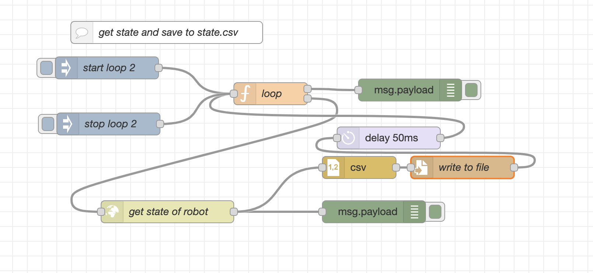

# save state

Using this flow, we create a csv file that holds information about the measurements of all the sensors that the diyrobot contains and information about the state the robot. 
More specifically, we hold information about the direction of movement of each motor, the distance that each motor has travelled measured in centimeters and revolutions and the distance that the ultarsonic sensor measures.

Using the `state.csv`, we can make analysis and visulaise different information. For example, using the `show_route.py` file, we produce a visualisation of the route that the robot follows. 

The flow that we use to create the `state.csv` is depicted below.

In this node-red flow, we can define the delay time, that means the duration between each record of state. A value of 50ms is good enough to make a great visualisation.
By pressing the start loop button, we start recording the activity of the robot.
By pressing the stop loop button, the recording stops and the file `state.csv` is created. Note that the new information will overwrite the old ones, so in case you want to keep a `state.csv` for future use, you should make a copy of it.
