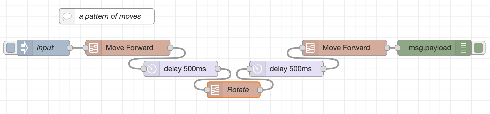
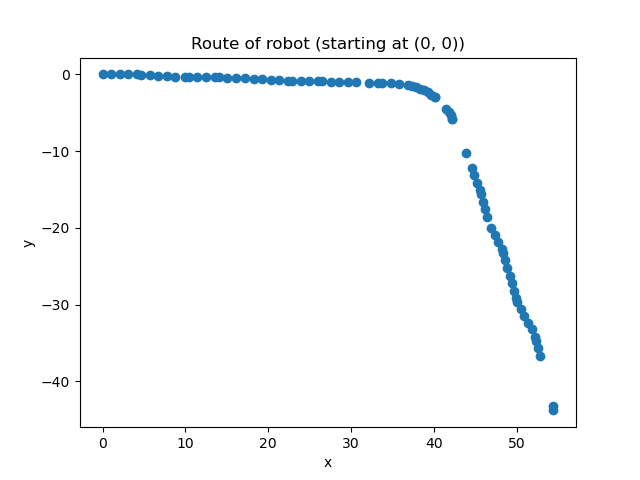

# Visualise Route

In this example, we want to make a visulisation of the route that the robot follows in the 2d plane.

The method of tracking the route of the robot is called 'Dead Reckoning'. That is because we try to figure out the route of the robot, while practically having no concrete visual input and just by measuring the movement of each motor. 

Keep in mind that you should pause between changes of directions, since the program may get the wrong of impresion about movement. Wait at least how long the frequency of sampling of measurements of the state of the robot.

In the `source/node-red/robot_state/` directory, you can find the `state.csv` file. This file holds a record of the most recent activity of the robot. To see how this file works, check the `save_state` example.

The directory contains a sample `state.csv` that was produced by running the subflow depicted below. 

This subflow shows a simple pattern of movements for the robot.
By running the `show_route.py` we make use of the `state.csv` file to produce a visualisation of the route of the robot. The corresponding `route.png` for the sample `state.csv` is depicted below.

